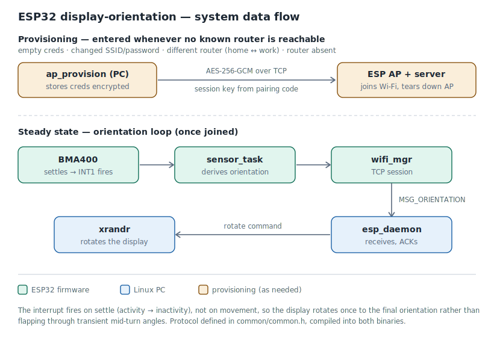

# ESP32 Display Orientation

Turn the board, and your monitor rotates to match.

An ESP32 with an accelerometer sits next to your desk. When you physically rotate it, it tells your
Linux PC over Wi-Fi, and the PC rotates the external display with `xrandr`. Useful if you have a
monitor on a pivot mount and you're tired of digging through display settings every time you switch
between reading a document and writing code.

---

## Demo

<!--
  TODO — when you have a clip of the board rotating and the monitor following:
    1. Save a short looping GIF as images/demo.gif (GitHub autoplays GIFs inline; keep it under ~10 MB),
       then uncomment the  block below.
    2. Upload the full-quality video as a GitHub Release asset or an unlisted YouTube video,
       and replace VIDEO_URL in the link below with its URL.
  Leaving the  commented until the GIF exists avoids showing a broken image on the page.
-->

<!--
<p align="center">
  
</p>
-->

A short demo video is available here: [watch the board rotate the display](VIDEO_URL).

_(Recording pending — turn the board, and the monitor follows.)_

---

## Requirements

**This needs X11.** It will not work on Wayland — the rotation is done by `xrandr`, and `xrandr`
cannot rotate a Wayland output, because the compositor owns the display rather than X. If you're on
Wayland, log in to an X11/Xorg session instead; most display managers offer this from a gear icon on
the login screen.

```sh
echo $XDG_SESSION_TYPE     # should say "x11"
```

| What          | You need                                                                 |
| ------------- | -------------------------------------------------------------------------|
| **PC**        | Linux with X11, `xrandr`, NetworkManager (`nmcli`), OpenSSL >= 1.1.0     |
| **Board**     | ESP32 + BMA400 accelerometer + HD44780 I²C LCD (shows the pairing code)  |
| **Toolchain** | ESP-IDF **v5.0 or newer** (built and tested on v5.5.3)                   |

The installer checks all of these and tells you exactly what's missing, rather than letting the
build fail with a wall of compiler errors.

**Wiring the board:** the BMA400 connects over SPI and the LCD over I²C — see
[`mcu/docs/schematic/`](mcu/docs/schematic/) for the wiring diagram and the exact GPIO assignments
(and one note worth reading if you power the LCD backpack at 5 V).

**On recent Intel graphics (Raptor Lake and similar), you may also need the `intel` DDX driver.**
X's default `modesetting` driver mishandles rotation on this hardware — the screens flicker and then
revert, while `xrandr` reports success and the daemon logs a successful rotate. See Troubleshooting;
it's a one-file config change.

---

## Quickstart

```sh
git clone https://github.com/PIYUSH-CHOUDHARY-04/esp32-display-orientation
cd esp32-display-orientation

./install.sh install          # builds both halves, installs the daemon and the service
./install.sh flash            # flashes the firmware to a connected ESP32
```

Then hand the board your Wi-Fi credentials — it has no keyboard, so it can't be told them any other
way:

```sh
ap_provision --set_creds      # prompts for SSID and password, stores them encrypted
ap_provision --pc=123456      # the pairing code shown on the ESP's LCD
```

That's it. The daemon is already running, and starts by itself at every login from now on.

---

## How it works

<p align="center">
  
</p>

<details>
<summary>Text version (if the diagram above doesn't render)</summary>

```
   ┌─────────────────────┐                      ┌──────────────────────┐
   │       ESP32         │                      │      Linux PC        │
   │                     │                      │                      │
   │  BMA400 ──► which   │   TCP over Wi-Fi     │  esp_daemon          │
   │            way up?  │ ───────────────────► │      │               │
   │                     │   MSG_ORIENTATION    │      ▼               │
   │  LCD: status,       │                      │   xrandr --rotate    │
   │       pairing code  │ ◄─────────────────── │                      │
   │                     │      MSG_ACK         │                      │
   └─────────────────────┘                      └──────────────────────┘
```

</details>

The ESP reads the accelerometer, works out its orientation, and sends a command. The daemon
acknowledges it and calls `xrandr`. The protocol is defined in `common/common.h` and compiled into
**both** binaries — which is what stops the two halves from silently disagreeing about the wire
format.

### Getting the board onto your Wi-Fi

The ESP has no keyboard, so it can't be told the Wi-Fi password directly. Whenever it can't reach a
known router — first boot with no stored credentials, a changed SSID or password, a different router
(home vs. workplace), or the saved router simply being absent — it falls back to bringing up its own
temporary access point and waits. `ap_provision` connects to it, hands over the credentials inside an
encrypted session, and disconnects — after which the ESP joins your real network and the AP
disappears.

**Two separate secrets are involved, and confusing them defeats the design:**

- The **user key** protects your credentials *at rest* on the PC. It is never written to disk. Lose
  it and the stored credentials are unrecoverable — which is the intended property, not a bug.
- The **pairing code** protects them *in transit* to the ESP. It's shown on the board's LCD, and both
  sides derive the same session key from it.

The pairing code is not the user key and cannot substitute for it.

---

## The two binaries

`esp_daemon` — the long-running daemon. Discovers the ESP on your network, holds a TCP session
with it, and rotates the display when a command arrives. Runs inside your login session, dies with
it.

`ap_provision` — an interactive tool, run by hand:

```sh
ap_provision --set_creds      # store new Wi-Fi credentials (prompts, encrypts, writes)
ap_provision --clear_creds    # wipe them
ap_provision --reset_key      # re-encrypt under a new user key
ap_provision --pc=<code>      # provision the ESP
ap_provision --help
```

Both install to `~/.local/bin`. **Nothing here needs `sudo`.**

---

## Where things live

```
.
├── client/          the PC side  — daemon + provisioning utility
│   ├── source/          main.c, netlink_monitor.c, ap_provision.c
│   └── include/         log.h, main.h, netlink_monitor.h
├── common/          the wire protocol, compiled into BOTH sides
├── mcu/             the ESP32 firmware (ESP-IDF project)
│   ├── main/
│   ├── components/      sensor, LCD, Wi-Fi manager, logging
│   └── docs/            datasheet links (PDFs gitignored) + schematic/ (wiring diagram + notes)
├── service/         how the daemon starts at login  (see service/README.md)
├── contrib/         optional configs -- currently the Intel DDX workaround
├── images/          diagrams the README references (data-flow, etc.)
├── env/             generated ESP-IDF environment
├── install.sh
├── uninstall.sh
└── Doxyfile
```

---

## The install script

Everything goes through one script.

| Command                | What it does                                           |
| ---------------------- | ------------------------------------------------------ |
| `./install.sh`         | build both halves                                      |
| `./install.sh client`  | build the PC binaries only                             |
| `./install.sh mcu`     | build the firmware only                                |
| `./install.sh install` | build, then install the binaries and the login service |
| `./install.sh clean`   | clean both halves                                      |
| `./install.sh env`     | re-detect the ESP-IDF and regenerate `env/idf_env.sh`  |
| `./install.sh --help`  | print the full command list and exit                   |
| *anything else*        | forwarded straight to `idf.py`                         |

So `flash`, `monitor`, `menuconfig` and the rest all work:

```sh
./install.sh flash
./install.sh monitor
./install.sh -p /dev/ttyUSB1 flash monitor
```

### It finds your ESP-IDF for you

The IDF lives somewhere different on every machine, so the installer looks — `$IDF_PATH`, then
`~/esp/esp-idf`, `~/embedded/sdks/esp/esp-idf`, `/opt/esp-idf` and the other usual places — and asks
if it still can't find one. It then writes `env/idf_env.sh` with the answer, so it only has to ask
once.

That file is **generated, not committed**: a hardcoded IDF path is correct for exactly one developer
and broken for everybody else.

### It checks the version before building

ESP-IDF v4.x will not build this firmware — it uses the v5 `esp_netif` and `esp_event` APIs. Rather
than letting you discover that through two hundred lines of compiler errors, the installer stops with
one sentence.

---

## Autostart

The daemon starts at login and stops at logout, via an **XDG autostart** entry:

| What gets installed        | Root? |
| -------------------------- | ----- |
| an XDG **autostart** entry | no    |

It starts the daemon **inside your session, as you** — which is the whole point. `xrandr` can only
reach an X server if it has that session's `DISPLAY` and its `XAUTHORITY` cookie, and a service
started as root at boot has neither. It would connect to the ESP, acknowledge every command, and
rotate nothing at all, while every log line looked perfectly healthy.

XDG autostart is a freedesktop.org standard read by the desktop session itself, so it works the same
on every desktop (GNOME, KDE, XFCE, Cinnamon, i3, sway, …) and every init system — and it's
**per-user**, so two people on the same machine each get their own entry and neither can overwrite
the other. (systemd *user* units can do this too, but only where the desktop activates
`graphical-session.target`, which many don't — so the installer uses the one mechanism that behaves
identically everywhere. The reasoning is laid out in full in `service/README.md`.)

Full details, including how to write your own, are in `service/README.md`.

```sh
pkill -f esp_daemon-session                 # stop it now
rm ~/.config/autostart/esp_daemon.desktop   # disable it permanently
```

---

## Logs

The daemon writes plain text to stdout and stderr and lets whatever started it decide where that
lands — so there's no journald dependency, no syslog dependency, and one binary that works
everywhere.

Because the desktop session launches it, its output goes wherever your session sends the output of
things it starts — on most desktops, `~/.xsession-errors`:

```sh
tail -f ~/.xsession-errors              # follow the daemon live
grep esp_daemon ~/.xsession-errors      # just its lines
```

A few setups differ (some route it to the journal, a bare `.xinitrc` sends it to its TTY); the full
table, and how to pin it to a file you control, is in `service/README.md`.

Verbosity, without recompiling:

```sh
LOG_LEVEL=debug esp_daemon              # error | warn | info | debug | verbose
esp_daemon -v                           # same thing
```

To make it permanent, add `export LOG_LEVEL=debug` to the wrapper
(`~/.local/bin/esp_daemon-session`), above the loop, and log back in.

---

## Uninstalling

```sh
./uninstall.sh                # remove the service and the binaries
./uninstall.sh --clean        # ... and the build artifacts
./uninstall.sh --purge        # ... and the stored Wi-Fi credentials
./uninstall.sh --all          # both of the above
./uninstall.sh --help         # list these options and exit
```

**Warning: `--purge` cannot be undone.** The user key protecting your credentials is never stored anywhere, so
once the encrypted file is gone there is nothing left to decrypt and no key to decrypt it with — not
even for you. That's why it's opt-in rather than part of a normal uninstall.

---

## Documentation

Every source file in this project is annotated. Generate the browsable version with:

```sh
doxygen Doxyfile
xdg-open doxygen/html/index.html
```

Organised into three modules — **PC Client**, **ESP Firmware**, and **Shared Protocol** — as one
tree rather than three, because `common.h` is compiled into both sides and the cross-references
between them are exactly what makes the docs worth reading.

Vendored code — Bosch's BMA400 driver, the HD44780 LCD driver from esp-idf-lib — is deliberately
excluded. It carries its own upstream documentation, and including it would bury this project's own
code under several thousand lines of somebody else's.

---

## Troubleshooting

### The daemon connects, acknowledges commands, and the screen never moves

Almost always Wayland. `xrandr` can enumerate outputs under XWayland and then rotate precisely
nothing.

```sh
echo $XDG_SESSION_TYPE     # "wayland" → this is your problem
```

Log in to an X11 session instead.

### xrandr exits 1, and the rotation is not applied

Same cause, or X is refusing the connection. If you're running the daemon by hand from `cron`, over
`ssh`, or from a service you wrote yourself, check it actually has a cookie:

```sh
echo $DISPLAY $XAUTHORITY
```

### The screens flicker black a few times, then snap back to normal

Seen on **Intel Raptor Lake** graphics, and likely on other recent Intel GPUs. Both displays blink
between black and their original orientation four or five times, and then settle back exactly where
they started. `xrandr` reports no error, and the daemon logs a successful rotation — because from
its point of view the call *did* succeed.

The rotation is being attempted and then rolled back by the driver. X's default `modesetting`
driver mishandles the rotated mode on this hardware: it fails to apply it, retries, and eventually
reverts rather than leaving you with a broken display.

The fix is to use Intel's own DDX driver instead. Install it:

```sh
sudo apt install xserver-xorg-video-intel      # Debian/Ubuntu
sudo dnf install xorg-x11-drv-intel            # Fedora
sudo pacman -S xf86-video-intel                # Arch
```

Then copy `contrib/20-intel.conf` from this repo to `/etc/X11/xorg.conf.d/`, or write it yourself:

```
Section "Device"
    Identifier  "Intel Graphics"
    Driver      "intel"
    Option      "TearFree"    "true"
EndSection
```

Log out and back in — this is read when X starts, so a restart of the daemon will not pick it up.

`TearFree` is not incidental. Rotation forces the GPU to redraw the whole framebuffer through a
transform, and without it the result tears visibly on every rotation. It costs a little memory
bandwidth and is worth it here.

**This is a workaround, not a fix.** `xf86-video-intel` is essentially unmaintained, and Intel
themselves now recommend `modesetting` for exactly this hardware. It happens to handle rotation
correctly where `modesetting` does not — so use it if you hit this, but expect the underlying bug to
be fixed upstream eventually, and check whether you still need the config.

### The ESP never appears

It hasn't joined your Wi-Fi. Check the LCD, and re-run `ap_provision --pc=<code>`. A wrong pairing
code is rejected immediately with `BAD_CRYPTO` rather than retried, so you'll know.

### xtensa-esp32-elf-gcc: command not found

You've cloned the ESP-IDF but not run its installer. Those are two separate steps:

```sh
cd $IDF_PATH && ./install.sh esp32
```

---

## Licence

MIT — see the `LICENSE` file at the repo root. Do what you like with it; just keep the copyright notice.

**Vendored components keep their own licences.** Two drivers under `mcu/components/` were not
written for this project and are **not** covered by the MIT licence above:

| Files                                                                 | Origin                            | Licence      |
| --------------------------------------------------------------------- | --------------------------------- | ------------ |
| `BMA400_SensorAPI/bma400.{c,h}`, `bma400_defs.h`, `examples/`         | Bosch Sensortec                   | BSD-3-Clause |
| `HD44780_LCD_I2C/hd44780.{c,h}`, `esp_idf_lib_helpers.h`, `ets_sys.h` | esp-idf-lib (Ruslan V. Uss, 2016) | BSD-3-Clause |

Both retain their original copyright headers, which BSD-3-Clause requires. **Do not strip them.**
Bosch's full licence text is in `mcu/components/BMA400_SensorAPI/LICENSE`.

### The HD44780 driver is modified — it is not upstream

Two changes were made to the esp-idf-lib driver for this project:

- `hd44780_t` gains a `void *user_ctx` field.
- `hd44780_init()` takes a second argument to populate it.

**Why:** the write callback's signature is `esp_err_t (*)(const hd44780_t *lcd, uint8_t data)` — it
receives the LCD descriptor and nothing else. A callback driving the panel over I²C therefore has
nowhere to keep its bus handle or its mutex, neither of which the driver knows anything about.
`user_ctx` is the hook: the driver stores it and never reads it, and the callback reaches it as
`lcd->user_ctx`.

Both files carry a modification notice below the original licence. BSD-3-Clause permits the change
and doesn't require the notice — but shipping someone else's copyrighted source, altered and
unmarked, invites a reader to diff it against upstream and find a difference nobody explained.

**Don't report bugs in those two changes to esp-idf-lib.** They're ours.

The wrappers written for *this* project — `sensor.c`, `sensor.h`, `lcd.c`, `lcd.h` — live in those
same directories but are ours, and are MIT like everything else. Vendored and original code sitting
side by side in one folder is a trap, so it's worth being explicit about which is which.

ESP-IDF itself is Apache-2.0 and is **not** redistributed here — you install it yourself, so its
licence is not this project's to carry.
