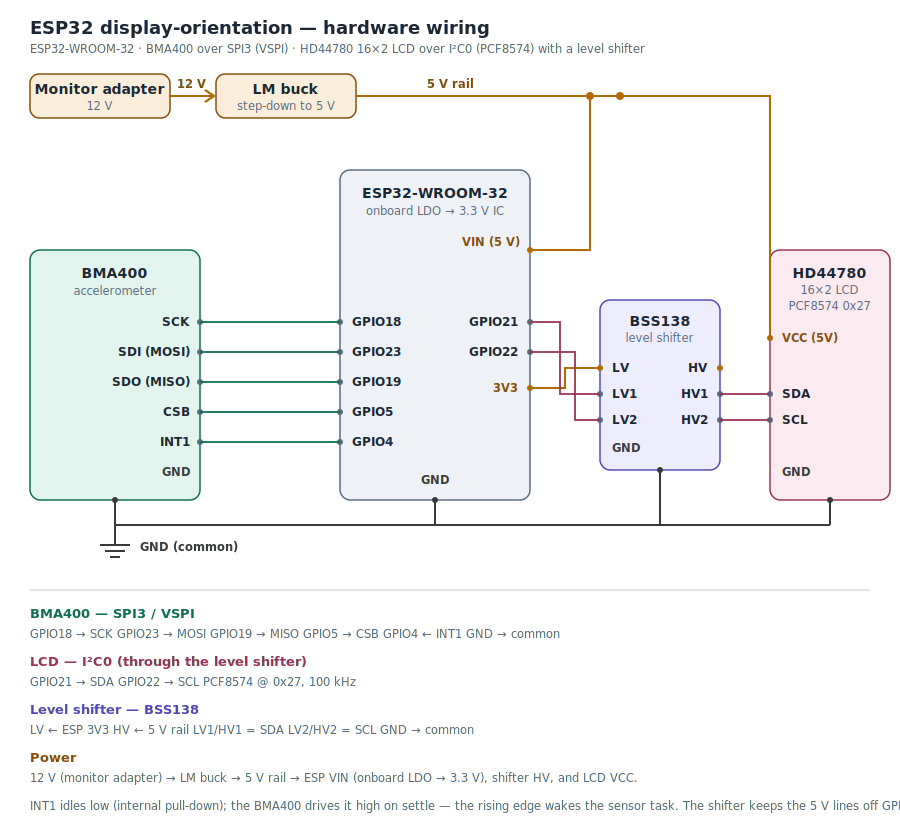

# Hardware wiring

The board is an **ESP32-WROOM-32** talking to two peripherals:

- a **BMA400** accelerometer over **SPI3 (VSPI)**, and
- an **HD44780 16×2 LCD** over **I²C0**, through a **PCF8574** backpack.

See the diagram below for the full wiring; this note is the text version, plus one electrical caveat
worth reading before you wire a fresh board.

<p align="center">
  
</p>

---

## Pin map

These are the firmware defaults. Change them in `mcu/components/BMA400_SensorAPI/sensor.c` and
`mcu/components/HD44780_LCD_I2C/lcd.c` if your wiring differs.

### BMA400 — SPI3 / VSPI

| BMA400 pin  | ESP32 GPIO | Signal              |
| ----------- | ---------- | ------------------- |
| SCK         | GPIO18     | SPI clock           |
| SDI (MOSI)  | GPIO23     | master → sensor     |
| SDO (MISO)  | GPIO19     | sensor → master     |
| CSB         | GPIO5      | chip select         |
| INT1        | GPIO4      | settle interrupt    |

Only **INT1** is used. It idles low (the ESP pin has its internal pull-down enabled); the BMA400
drives it high on a settle event, and that **rising edge** wakes the sensor task. INT2 is not wired.

### LCD — I²C0 (via PCF8574)

| Signal | ESP32 GPIO | Notes                           |
| ------ | ---------- | --------------------------------|
| SDA    | GPIO21     | I²C data                        |
| SCL    | GPIO22     | I²C clock                       |
| —      | —          | PCF8574 address `0x27`, 100 kHz |

The PCF8574's port bits map to the HD44780 lines (RS, RW, E, backlight, D4–D7) on the backpack
itself; the ESP only ever sees SDA and SCL.

---

## Power

```
12 V (monitor adapter) → LM-series buck → 5 V rail ┬→ ESP32 VIN (onboard LDO → 3.3 V for the IC)
                                                   └→ LCD backpack VCC (5 V)
```

The 5 V rail feeds two things: the ESP32 board's `VIN` pin (its onboard regulator makes the 3.3 V
the chip runs on) and the LCD backpack's `VCC` (the PCF8574 and HD44780 want 5 V).

---

## The I²C level shifter, and why the diagram shows one

The PCF8574 backpack runs at **5 V**, but the ESP32's `GPIO21`/`GPIO22` are **3.3 V** pins and are
**not 5 V-tolerant**. The diagram therefore puts a **BSS138 level shifter** in the I²C path — the LV
side referenced to the ESP's 3.3 V, the HV side to the 5 V rail, `SDA` and `SCL` passing through. This
is the correct way to bridge a 5 V I²C peripheral to a 3.3 V microcontroller, and it is what a fresh
build should use.

**Why it's needed.** I²C is **open-drain**: no device ever drives a line high. Lines are pulled low
by whoever is talking, and pulled back up by **pull-up resistors**. What matters is *the voltage those
pull-ups tie to*. On most PCF8574 backpacks the pull-ups sit on the board's own 5 V rail — so when the
bus is idle, `SDA` and `SCL` rest at `~5 V`, and without a shifter those lines run straight into the
ESP32's 3.3 V pins.

**How to tell if yours is affected.** Power the board, leave it idle, and measure DC volts from `SDA`
to `GND`:

- `~3.3 V` → pull-ups are already on the 3.3 V side; a shifter isn't strictly required.
- `~5 V` (often reads ~4.5 V, because the ESP's internal clamp is already pulling it down) →
  pull-ups are on the 5 V rail. Use the shifter shown in the diagram.

**A simpler no-shifter alternative** is to **power the backpack at 3.3 V** instead of 5 V: the
pull-ups then reference 3.3 V and everything is in spec with zero extra parts. The trade-off is
weaker HD44780 contrast at 3.3 V — turn up the backpack's contrast trimpot; on some panels it is
still a little faint, which is exactly why the level-shifter route (LCD at a happy 5 V, ESP pins safe)
is the one drawn as the default.

> **On the reference build:** the original desk build ran the backpack at 5 V *without* a shifter and
> relied on the ESP32's internal clamp diodes. That works — the clamp holds the pins near 3.3 V — but
> it is out of spec, and continuous clamping is a low-grade stress that can shorten a pin's life. The
> diagram documents the *correct* approach rather than that shortcut; if you are rebuilding, add the
> shifter (or power the backpack at 3.3 V).

## Reference

For a full ESP32 pinout — which GPIOs are safe, the default I²C/SPI pins, the power pins — see Last
Minute Engineers' [ESP32 Pinout Reference](https://lastminuteengineers.com/esp32-pinout-reference/).
(External link; their diagrams are their own copyrighted work and are not redistributed here.)
